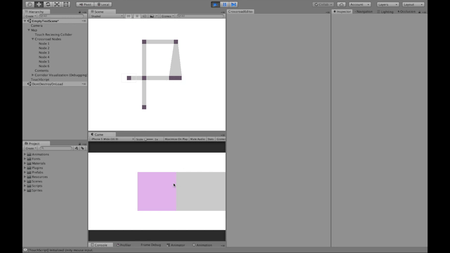
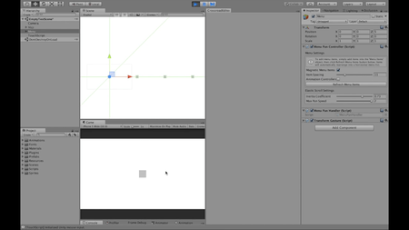

# Bachaleor Thesis

[Thesis Archive ->](https://is.muni.cz/th/m142o/)

[Full Text ->](https://is.muni.cz/th/m142o/Bakalarska_Prace.pdf)

**Abstract**

The thesis describes the development of touch user interfaces in mobile game development by using Unity game engine. Both the theoretical and the practical parts of the thesis focus on the elastic scrolling feature. The outcome of the practical solution is an extension of Unity that offers two distinct touch controllers:

 - (Elastic) Scrolling in a grid of crossroads and 
 - (Elastic) Scrolling with snapping to items of in a list

These two touch controllers feature elastic scrolling as well as tools for user-friendly creations of touch user interfaces based on two previously mentioned controllers. Finally, a mobile demo app has been created to demonstrate the functionality of the created extension.

These tools enable creating two kinds of touch interfaces

Using custom tools to create touch enabled grid of crossroads:

Custom crossroad touch controller in action:

Custom snap to item touch controller in action

